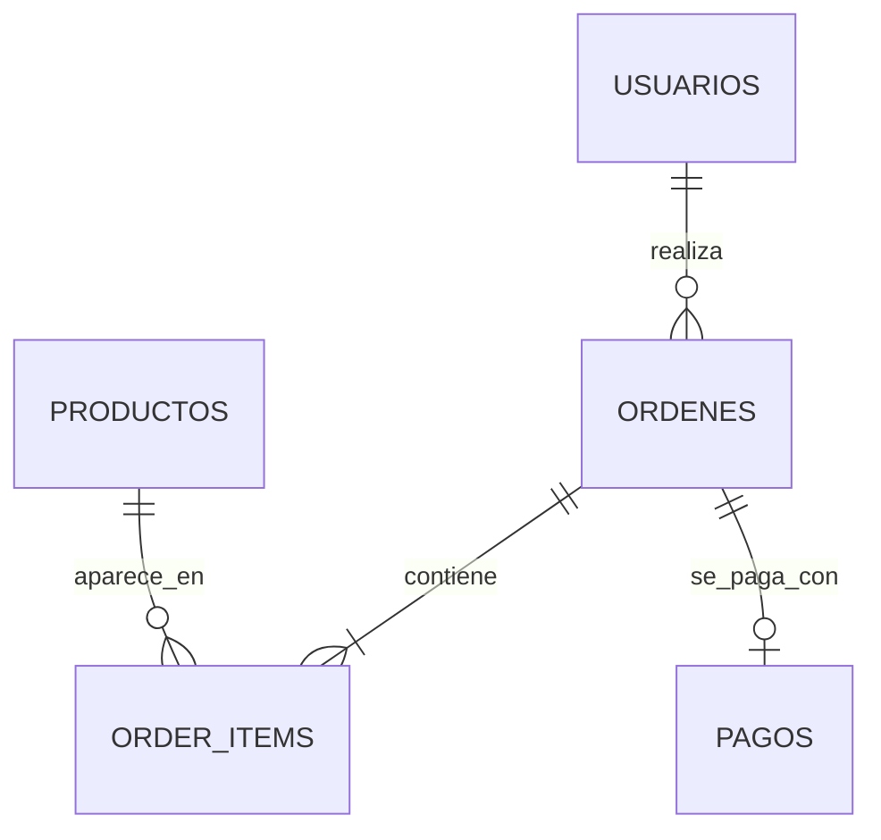
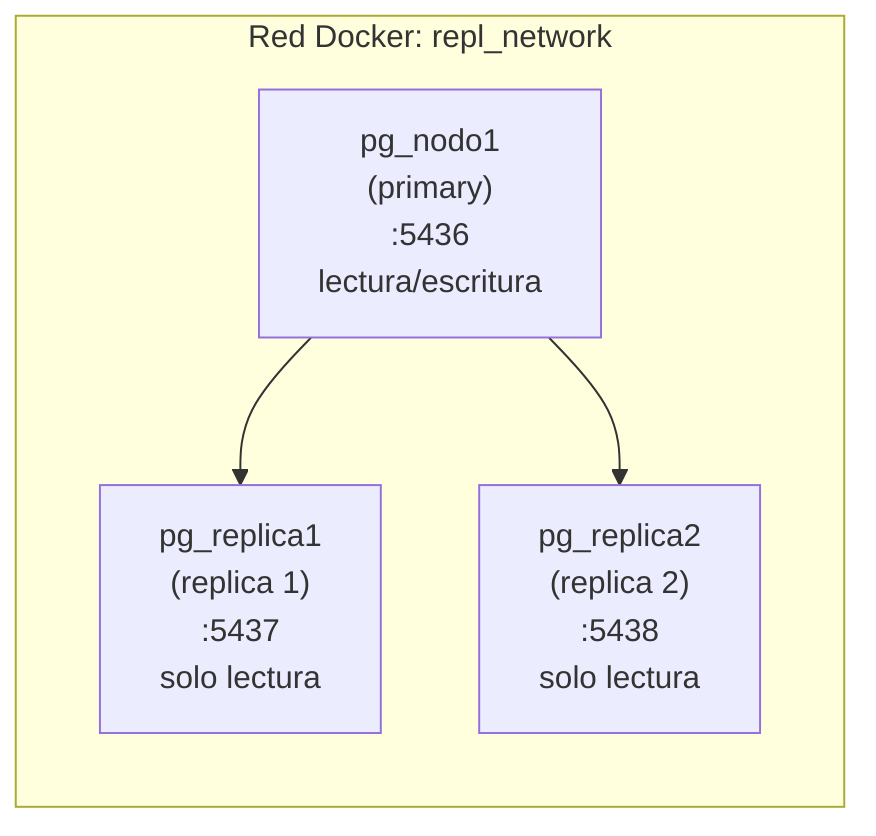

# Proyecto 2 — Arquitecturas Distribuidas
## SI3009 Bases de Datos Avanzadas, 2026-1
### PostgreSQL Distribuido: Particionamiento, Replicación y Transacciones

---

## 1. Contexto del dominio

Trabajamos con un sistema de **ecommerce** como dominio de aplicación. Escogimos este dominio porque permite demostrar de forma natural los conceptos de distribución: los usuarios hacen órdenes constantemente, los pagos deben ser atómicos con las órdenes, y el volumen de datos crece rápido.

Reutilizamos el dominio del Proyecto 1 para enfocarnos en los aspectos distribuidos, extendiendo el modelo de datos para soportar particionamiento y transacciones distribuidas.

---

## 2. Modelo de datos

El sistema tiene 5 tablas principales:

| Tabla | Descripción | Nodo principal | Estrategia de particionamiento |
|---|---|---|---|
| `usuarios` | Clientes registrados | Nodo 1 | Sin particionar |
| `productos` | Catálogo con stock | Nodo 2 | Sin particionar |
| `ordenes` | Cabecera de cada compra | Los 3 nodos | Hash por `usuario_id` |
| `order_items` | Líneas de cada orden | Los 3 nodos | Hash por `orden_id` |
| `pagos` | Registro de pago por orden | Nodo 3 | Rango por `fecha` |

**Por qué este diseño:**
- `ordenes` y `order_items` se distribuyen por hash para balancear la carga uniformemente entre nodos. El hash garantiza que todas las órdenes de un mismo usuario caigan en el mismo nodo, lo que hace eficientes las consultas de historial.
- `pagos` se particiona por rango de fecha porque los reportes financieros siempre consultan por períodos. Esto permite que el motor descarte particiones completas en queries analíticas (partition pruning por rango).
- No se usan llaves foráneas entre tablas de nodos distintos porque PostgreSQL no puede enforzarlas entre nodos independientes — este es uno de los trade-offs documentados más adelante.

### Diagrama entidad-relación



---

## 3. Volúmenes estimados

| Tabla | Filas objetivo | Filas cargadas | Justificación |
|---|---|---|---|
| `usuarios` | 100.000 | 10.000 | Base de clientes activos |
| `productos` | 10.000 | 1.000 | Catálogo típico |
| `ordenes` | 5.000.000 | 500.000 | ~50 órdenes por usuario |
| `order_items` | 15.000.000 | 1.500.000 | ~3 ítems por orden |
| `pagos` | 5.000.000 | 500.000 | 1 pago por orden |

> Los datos se generaron con scripts SQL usando `generate_series()` de PostgreSQL. Por restricciones de recursos en entorno local (Docker), se trabajó con el 10% del volumen objetivo. La arquitectura y los experimentos son equivalentes y escalables a los volúmenes completos.

---

## 4. Operaciones OLTP y OLAP

**OLTP** (transacciones del día a día, alta frecuencia):
- Registrar nueva orden + pago (escenario del 2PC)
- Consultar estado de una orden por `usuario_id`
- Actualizar stock de un producto
- Cancelar una orden y revertir el pago

**OLAP** (consultas analíticas, cruzan particiones):
- Total de ventas por mes y región
- Productos más vendidos por categoría
- Órdenes completadas vs canceladas por período
- Ingreso promedio por usuario

---

## 5. Infraestructura

### Arquitectura

El ambiente tiene dos capas: los 3 nodos de particionamiento (Persona 1) y el clúster de replicación primario-réplicas (Persona 2), ambos corriendo en Docker.

**Nodos de particionamiento:**
```
┌─────────────────────────────────────────────┐
│              Red Docker: pg_network          │
│                                             │
│  ┌──────────┐  ┌──────────┐  ┌──────────┐  │
│  │  Nodo 1  │  │  Nodo 2  │  │  Nodo 3  │  │
│  │ :5433    │  │ :5434    │  │ :5435    │  │
│  │          │  │          │  │          │  │
│  │ usuarios │  │productos │  │  pagos   │  │
│  │ordenes_0 │  │ordenes_1 │  │ordenes_2 │  │
│  │items_0   │  │items_1   │  │items_2   │  │
│  └──────────┘  └──────────┘  └──────────┘  │
│                                             │
│  ┌──────────┐                               │
│  │ PgAdmin  │  :5050                        │
│  └──────────┘                               │
└─────────────────────────────────────────────┘
```

**Clúster de replicación:**


**Nodo 1** actúa como coordinador del particionamiento — tiene configurado `postgres_fdw` para ver las particiones de Nodo 2 y Nodo 3 como si fueran locales.

### Levantar el ambiente

Una opción fácil para ejecutar los scripts de esquema por nodo es usar directamente el Query Tool de PgAdmin (abres cada nodo y ejecutas el archivo SQL correspondiente). Si prefieres terminal, usa estos comandos:

```bash
# Nodos de particionamiento
cd Proyecto2/infra/
docker compose up -d
docker compose ps

# Schemas por nodo
docker exec -i pg_nodo1 psql -U admin -d ecommerce < ../scripts/schemas/nodo1_schema.sql
docker exec -i pg_nodo2 psql -U admin -d ecommerce < ../scripts/schemas/nodo2_schema.sql
docker exec -i pg_nodo3 psql -U admin -d ecommerce < ../scripts/schemas/nodo3_schema.sql

# Configurar FDW
docker exec -i pg_nodo1 psql -U admin -d ecommerce < ../scripts/02_fdw_setup.sql

# Poblar con datos
docker exec -i pg_nodo2 psql -U admin -d ecommerce < ../scripts/small_data/03a_poblar_nodo2_small.sql
docker exec -i pg_nodo3 psql -U admin -d ecommerce < ../scripts/small_data/03b_poblar_nodo3_small.sql
docker exec -i pg_nodo1 psql -U admin -d ecommerce < ../scripts/small_data/03c_poblar_nodo1_small.sql
```

PgAdmin disponible en `http://localhost:5050` — `admin@admin.com` / `admin`

---

## 6. Particionamiento

### Configuración

Usamos dos estrategias de particionamiento según la tabla:

**Hash en `ordenes` y `order_items`** — distribuye filas uniformemente según el hash del campo clave. Cada nodo recibe aproximadamente el mismo número de filas sin importar el patrón de uso.

**Rango en `pagos`** — divide los datos por períodos de tiempo, ideal para queries analíticas que filtran por fecha.

La implementación completa está en `scripts/schemas/nodo1_schema.sql`, `scripts/schemas/nodo2_schema.sql` y `scripts/schemas/nodo3_schema.sql`.

### Resultado de la distribución

Después de insertar 500.000 órdenes y 1.500.000 order_items desde el Nodo 1 coordinador:

**Distribución de `ordenes`:**

| Partición | Filas | Porcentaje |
|---|---|---|
| `ordenes_nodo0` (Nodo 1) | 163.850 | 32.77% |
| `ordenes_nodo1` (Nodo 2) | 168.450 | 33.69% |
| `ordenes_nodo2` (Nodo 3) | 167.700 | 33.54% |

**Distribución de `order_items`:**

| Partición | Filas | Porcentaje |
|---|---|---|
| `order_item_nodo0` (Nodo 1) | 501.990 | 33.47% |
| `order_item_nodo1` (Nodo 2) | 499.218 | 33.28% |
| `order_item_nodo2` (Nodo 3) | 498.792 | 33.25% |

La distribución es casi perfecta en ambas tablas — el hash cumple su objetivo de balancear la carga.

### Enrutamiento manual

Una limitación importante de PostgreSQL es que **no es un motor distribuido nativo**. Implementamos el enrutamiento usando `postgres_fdw` (Foreign Data Wrapper): el Nodo 1 tiene conexiones a Nodo 2 y Nodo 3, y las particiones remotas están adjuntadas como si fueran locales. La configuración completa está en `scripts/02_fdw_setup.sql`.

**Limitación encontrada:** PostgreSQL no permite PRIMARY KEY en tablas particionadas cuando alguna partición es una tabla foránea. El motor no puede garantizar unicidad global entre nodos que no controla. Tuvimos que reemplazar el PRIMARY KEY por un índice simple — la integridad referencial pasa a ser responsabilidad de la aplicación.

---

## 7. Joins distribuidos — EXPLAIN ANALYZE

Un join distribuido es una consulta que necesita datos de particiones en distintos nodos. Todos los scripts están en `scripts/05_joins_distribuidos_explain_analyze.sql`.

### Consulta 1 — Join simple (208 ms)

Cruza `ordenes` (3 particiones) con `usuarios` (local), filtrando por estado `completada`.

| Operación | Tiempo |
|---|---|
| `Seq Scan on ordenes_nodo0` (local) | 22 ms |
| `Foreign Scan on ordenes_nodo1` (remoto) | 439 ms |
| `Foreign Scan on ordenes_nodo2` (remoto) | 399 ms |

El acceso remoto cuesta ~20x más que el local. El coordinador usa `Memoize` para cachear los lookups de usuarios y no repetir el Index Scan en cada fila.

### Consulta 2 — Join triple con agregación (4.718 ms)

Cruza `ordenes`, `usuarios` y `order_items`, calcula el total por orden.

- Los dos `Foreign Scan` de `order_items` suman 2.459 ms — más del 50% del tiempo total es latencia FDW
- La agregación de ~449k filas desbordó memoria y usó disco (`Disk Usage: 30.648 kB`)
- El filtro de fecha se ejecuta en el nodo remoto (pushdown), reduciendo datos transferidos

### Consulta 3 — OLAP ventas por región y mes (734 ms)

Agrega ingresos por región y mes para 2025-2026. Devuelve 96 filas.

- `Seq Scan` local: 20 ms vs `Foreign Scan`: ~225 ms promedio
- El pushdown de predicados funciona — los filtros se envían al nodo remoto
- `Incremental Sort` aprovecha el orden parcial de los grupos

### Consulta 4 — Partition pruning hash (3.9 ms)

Busca órdenes de un usuario específico (`usuario_id = 100042`).

- Solo toca 1 partición de 3 — PostgreSQL calcula `hash(100042) % 3 = 1` en planificación
- Reducción de ~53x frente al full scan (208 ms → 3.9 ms)

---

## 8. Transacciones distribuidas — 2PC

### Por qué no podemos usar el coordinador FDW para el 2PC

PostgreSQL no permite ejecutar `PREPARE TRANSACTION` en una sesión que haya interactuado con tablas foráneas vía FDW. Por esto, cada fase del 2PC debe ejecutarse directamente en el nodo físico donde viven los datos. Los scripts completos están en `scripts/06_two_phase_commit_manual.sql`.

### Escenario implementado

Checkout del usuario `100002`:
- Orden → `ordenes_nodo0` → **Nodo 1** (`hash(100002) % 3 = 0`)
- Pago → **Nodo 3**

### Experimento 1 — 2PC exitoso

**Fase 1:** ambos nodos ejecutan `PREPARE TRANSACTION 'txn_checkout_001'`. Los datos quedan bloqueados y no visibles para otras sesiones. `pg_prepared_xacts` muestra la transacción pendiente en ambos nodos.

**Fase 2:** `COMMIT PREPARED 'txn_checkout_001'` en cada nodo. Resultado: orden `999001` y pago `400001` confirmados. `pg_prepared_xacts` vacío.

### Experimento 2 — Fallo del coordinador tras el Prepare

1. Ambos nodos preparan `txn_checkout_002` exitosamente
2. `docker stop pg_nodo1` — coordinador caído
3. `pg_prepared_xacts` en Nodo 3 sigue mostrando la transacción — **recursos bloqueados**
4. Intento de INSERT sobre `orden_id = 999002` en Nodo 3 — tardó **19 segundos** esperando el lock
5. `docker start pg_nodo1` — coordinador recuperado
6. `pg_prepared_xacts` en Nodo 1 sigue mostrando `txn_checkout_002` — **el PREPARE sobrevivió el crash** gracias al WAL
7. COMMIT final en ambos nodos — orden `999002` y pago `400002` confirmados

**Conclusión:** cuando el coordinador falla después de la Fase 1, los recursos quedan bloqueados hasta que se recupera o un DBA interviene manualmente. No existe un mecanismo automático de resolución.

---

## 9. Replicación

### Configuración líder-seguidor

Se configuró un nodo primary (`pg_nodo1`) con dos réplicas de solo lectura (`pg_replica1`, `pg_replica2`) usando streaming replication de PostgreSQL.

La guía paso a paso de configuración de replicación está en `replicacion/guiaConfReplicacion.md`.

### Experimento 1 — Replicación síncrona vs asíncrona

Se midió el tiempo de 500 inserts en la tabla `usuarios` en cada modo:

| Modo | Tiempo (500 inserts) |
|---|---|
| Asíncrono (`synchronous_commit = off`) | 10.093 ms |
| Síncrono (`synchronous_commit = on`) | 16.307 ms |

En modo síncrono el primary espera confirmación de la réplica antes de responderle al cliente — por eso es más lento. En modo asíncrono no espera esa confirmación, lo que reduce la latencia pero introduce el riesgo de perder datos recientes si el primary cae antes de que la réplica reciba el WAL.

### Experimento 2 — Impacto del número de réplicas en modo síncrono

| Réplicas activas | Tiempo (500 inserts) |
|---|---|
| 2 réplicas | 21.434 ms |
| 1 réplica | 10.652 ms |

Con dos réplicas en modo síncrono el primary debe esperar confirmación de ambas, lo que duplica aproximadamente la latencia de escritura.

### Experimento 3 — Latencia de lectura: primary vs réplica

Se ejecutaron las mismas queries en `pg_nodo1` (primary) y `pg_replica1`:

| Consulta | Primary | Réplica | Diferencia |
|---|---|---|---|
| Agregado por región | 1.472 ms | 1.779 ms | +0.3 ms |
| Filtro por región y fecha | 1.053 ms | 1.370 ms | +0.3 ms |
| Ordenar por fecha con límite | 2.367 ms | 2.439 ms | +0.07 ms |

La diferencia es pequeña pero consistente — el primary es ligeramente más rápido porque tiene estadísticas más actualizadas y no tiene overhead de aplicar WAL entrante mientras atiende queries.

### Experimento 4 — Failover y promoción

**Escenario:** caída del nodo primary.

1. Estado antes de la caída: 3.000 usuarios, WAL en `0/522D248`
2. `docker stop pg_nodo1` — primary caído
3. `pg_ctl promote` en `pg_replica1` — réplica promovida a primary
4. Verificación: `SELECT pg_is_in_recovery()` devuelve `false` en `pg_replica1`
5. INSERT exitoso en `pg_replica1` — confirmación de escritura disponible
6. `pg_replica2` reconectada al nuevo primary — aparece en `pg_stat_replication` con `state = streaming`

### Prevención de split-brain

Antes de promover una réplica se verifica que el WAL recibido y aplicado sean iguales:

```sql
SELECT
    pg_last_wal_receive_lsn() AS wal_recibido,
    pg_last_wal_replay_lsn()  AS wal_aplicado;
```

Si los valores coinciden, la réplica está al día y es seguro promoverla. Adicionalmente se verifica con `docker ps` que el primary original esté efectivamente detenido antes de la promoción, para evitar que dos nodos crean ser el primary al mismo tiempo.

---

## 10. Análisis crítico

### Lo que aprendimos de PostgreSQL distribuido

**Diseño:** tuvimos que tomar decisiones explícitas sobre dónde vive cada tabla, qué estrategia de particionamiento usar, y cómo configurar el FDW. En un NewSQL estas decisiones son automáticas.

**Constraints:** no podemos tener llaves foráneas entre nodos ni PRIMARY KEY en tablas particionadas con particiones foráneas. La integridad referencial es responsabilidad de la aplicación.

**2PC:** no funciona a través del FDW. El DBA debe conocer en qué nodo físico vive cada dato para ejecutar el PREPARE directamente.

**Rendimiento:** el acceso remoto vía FDW cuesta ~20x más que el local. Más del 50% del tiempo de una query compleja con joins distribuidos es latencia de red.

**Replicación:** funciona bien y es madura, pero la gestión del failover es manual. No hay elección automática de nuevo líder — alguien tiene que ejecutar `pg_ctl promote`.

### Comparación con NewSQL

#### Arquitectura y configuración

| Aspecto | PostgreSQL + FDW | CockroachDB |
|---|---|---|
| Distribución de datos | Manual: PARTITION BY HASH y RANGE vía FDW | Automática: auto-sharding sin configuración manual |
| Replicación | Streaming manual: 1 primary + 2 réplicas de solo lectura | Automática: factor 3 en todos los nodos por defecto |
| Consenso | No aplica — replicación unidireccional | Protocolo Raft con leaseholder |
| FK distribuidas | No soportadas — integridad referencial en la aplicación | Soportadas nativamente entre nodos |
| Failover | Manual: `pg_ctl promote` + reconfigurar réplicas | Automático: Raft elige nuevo leaseholder |
| Consistencia | Configurable: síncrona o asíncrona (`synchronous_commit`) | Serializable por defecto (linealizable) |
| Enrutamiento | FDW — configuración manual por tabla | Transparente: el cliente se conecta a cualquier nodo |
| Teorema CAP | PA (disponibilidad sobre consistencia en modo asíncrono) | CP (consistencia sobre disponibilidad) |

#### Latencia comparativa

| Operación | PostgreSQL | CockroachDB |
|---|---|---|
| Lectura simple GROUP BY | 1.472 ms | 272 ms (500K filas) |
| Lectura con filtro WHERE | 1.053 ms | 344 ms (JOIN 600K filas) |
| Lectura ORDER BY LIMIT 100 | 2.367 ms | 2 ms (por PK) |
| Escritura 500 inserts (asíncrono) | 10.093 ms | 4 ms (1 insert) |
| Escritura 500 inserts (síncrono 2 réplicas) | 21.434 ms | N/A — siempre síncrono |
| Failover / recuperación | Manual (minutos) | Automático (~segundos) |

> *Los tiempos de PostgreSQL se midieron con ~3.000 usuarios. Los de CockroachDB con 3.010.000 filas. La comparación directa no es perfecta por diferencia de volumen, pero refleja el comportamiento real de cada sistema.*

#### Tolerancia a fallas

| Escenario | PostgreSQL | CockroachDB |
|---|---|---|
| 1 nodo caído | Sistema funciona solo en lectura (réplicas disponibles) | Sistema funciona normal (quórum 2 de 3) |
| Nodo primary caído | Requiere promoción manual de réplica | Raft elige nuevo leaseholder automáticamente |
| 2 nodos caídos | Sistema degradado — solo 1 réplica de solo lectura | ERROR: lost quorum — sistema bloqueado por consistencia |
| Split-brain | Posible si no se verifica WAL antes de promover | Imposible por diseño — Raft lo previene |

#### Complejidad operacional

| Tarea | PostgreSQL | CockroachDB |
|---|---|---|
| Configuración inicial | Alta: FDW, particiones, replicación, pg_hba.conf, WAL | Baja: `docker compose up` + init |
| Agregar un nodo | Alta: configurar replicación, FDW, particiones foráneas | Baja: agregar al `--join`, el clúster redistribuye solo |
| Monitoreo | `pg_stat_replication`, logs manuales | UI web integrada en `:8080`, `SHOW RANGES` |
| Migraciones de schema | Por nodo — riesgo de inconsistencia entre nodos | Distribuidas automáticamente a todos los nodos |
| Soporte ENUM types | Nativo con `CREATE TYPE` | Requiere usar TEXT (limitación encontrada) |

### Impacto en costos

| Factor de costo | PostgreSQL distribuido | CockroachDB |
|---|---|---|
| Licencia | Gratuito (open source) | Gratuito hasta 10 nodos (Core). Enterprise desde ~$30.000/año |
| Infraestructura | 3 VMs. El coordinador es un SPOF — necesita alta disponibilidad propia | 3+ nodos. Sin SPOF por diseño |
| Configuración inicial | Alto: días o semanas para un DBA experimentado | Bajo: horas para levantar un clúster funcional |
| Operación continua | Alto: monitoreo manual, failover manual, mantenimiento de FDW | Medio: el sistema se autogestiona pero requiere entender Raft |
| Capacitación del equipo | Medio: PostgreSQL es conocido pero FDW y replicación streaming son especializados | Alto: CockroachDB tiene paradigmas distintos (rangos, leaseholders, quórum) |
| Migración desde monolítico | Medio: mismo motor, diferente arquitectura | Alto: cambios en schema, tipos de datos, IDs, herramientas |
| Soporte en incidentes | Comunidad activa + soporte empresarial EDB (~$15.000/año) | Soporte empresarial Cockroach Labs (~$50.000/año) |
| Cloud managed (alternativa) | AWS RDS Multi-AZ: ~$500-2.000/mes según tamaño | CockroachDB Serverless: desde $0 (free tier), Dedicated desde ~$1.000/mes |

**El verdadero costo oculto: la complejidad cognitiva**

El mayor costo de los sistemas distribuidos no está en la infraestructura sino en la complejidad que impone al equipo. Cada decisión que antes era simple — insertar un registro, hacer un JOIN, hacer un backup — se convierte en una pregunta de arquitectura distribuida. En el proyecto esto se evidenció de forma concreta: tuvimos que eliminar las claves foráneas porque PostgreSQL no las soporta entre nodos, y adaptar los tipos ENUM porque CockroachDB los maneja diferente. Problemas pequeños en un proyecto académico, pero en producción representan horas de trabajo de ingenieros senior.

**La regla de oro:** no distribuyas hasta que tengas que hacerlo. La mayoría de aplicaciones pueden servir millones de usuarios con una sola instancia de PostgreSQL bien configurada. La distribución horizontal debe ser el último recurso, no el primero.

**¿Cuándo sí tiene sentido el costo?** Cuando el volumen supera lo que un solo servidor puede manejar físicamente (típicamente >5TB en tablas de transacciones), cuando los requisitos de disponibilidad exigen 99.99%+ de uptime, cuando la regulación exige datos en múltiples regiones simultáneamente, o cuando las escrituras superan ~50.000/segundo sostenidas.

### Experiencia de aprendizaje y reflexión final

Cada integrante del equipo enfrentó retos distintos que en conjunto ilustran por qué las bases de datos distribuidas son uno de los temas más complejos en ingeniería de software.

La implementación del sharding manual en PostgreSQL demostró que el motor no fue diseñado para distribución nativa: las claves foráneas entre nodos no son posibles, el 2PC no funciona a través del FDW, y cada decisión de diseño tiene un costo concreto. La replicación expuso el dilema fundamental de consistencia vs. latencia: modo síncrono con 2 réplicas cuesta el doble en tiempo (21.4 ms vs 10.1 ms). CockroachDB simplifica la operación distribuida, pero no es gratis: es CP por diseño (con quórum perdido el sistema se bloquea), los ENUM types requieren adaptación, y los IDs SERIAL no son secuenciales en un entorno distribuido.

En la industria colombiana, casos como **Nubank** (que usa CockroachDB en producción para garantizar consistencia ACID en transacciones financieras distribuidas entre regiones) y **Mercado Libre** (que usa PostgreSQL con sharding a nivel de aplicación para mayor control sobre la distribución) muestran que no existe una solución universal. La elección depende del contexto, el equipo, y los requisitos reales de escala.

> *La distribución horizontal es una herramienta poderosa pero no es una bala de plata. El mayor aprendizaje de este proyecto es que la complejidad de los sistemas distribuidos es real, costosa y frecuentemente subestimada. Conocerla a fondo es la mejor preparación para tomar decisiones informadas en la industria.*

## 11. Impacto en administración

| Dimensión | Centralizada (PostgreSQL monolítico) | Distribuida (FDW / CockroachDB) | Servicio nube (RDS, CockroachDB Serverless) |
|---|---|---|---|
| Responsabilidad del DBA | Alta: todo es responsabilidad interna | Muy alta: coordinación entre nodos adicional | Baja: el proveedor gestiona backups, parches, failover |
| Escalabilidad | Vertical (más CPU/RAM al servidor) | Horizontal (agregar nodos) | Automática (el proveedor escala según demanda) |
| Tiempo de recuperación | Minutos a horas (backup + restore o failover manual) | Segundos a minutos (automático en NewSQL, manual en PG) | Segundos (gestionado por el proveedor) |
| Costo de personal | 1 DBA puede gestionar varios sistemas | Requiere DBA especializado en sistemas distribuidos (escaso y caro) | Mínimo: el proveedor asume la mayor carga operacional |
| Control sobre los datos | Total | Total | Parcial: datos en infraestructura del proveedor |
| Vendor lock-in | Ninguno | Bajo en PG, Medio en CockroachDB | Alto: migración fuera del proveedor es costosa |
| Adecuado para | Startups, empresas medianas, <1M usuarios activos | Empresas grandes con requisitos de escala horizontal o multiregión | Empresas que priorizan velocidad de desarrollo sobre control y costo |

**Recomendación del equipo para una empresa colombiana:**

- **Fase 1 (0–100K usuarios):** PostgreSQL monolítico bien configurado con índices, connection pooling (PgBouncer) y réplicas de lectura. No distribuir aún.
- **Fase 2 (100K–1M usuarios):** Evaluar si el cuello de botella es lectura (agregar réplicas) o escritura (considerar sharding a nivel de aplicación antes que de base de datos).
- **Fase 3 (>1M usuarios o requisitos multiregión):** Evaluar CockroachDB Serverless o Cloud Spanner si el equipo no tiene experiencia en distribuidos. Considerar PostgreSQL + Citus si el equipo ya conoce PostgreSQL.
- **Solo distribuir on-premise** si hay un equipo dedicado con experiencia en sistemas distribuidos y los requisitos de control de datos lo exigen (sector financiero, salud, gobierno).
